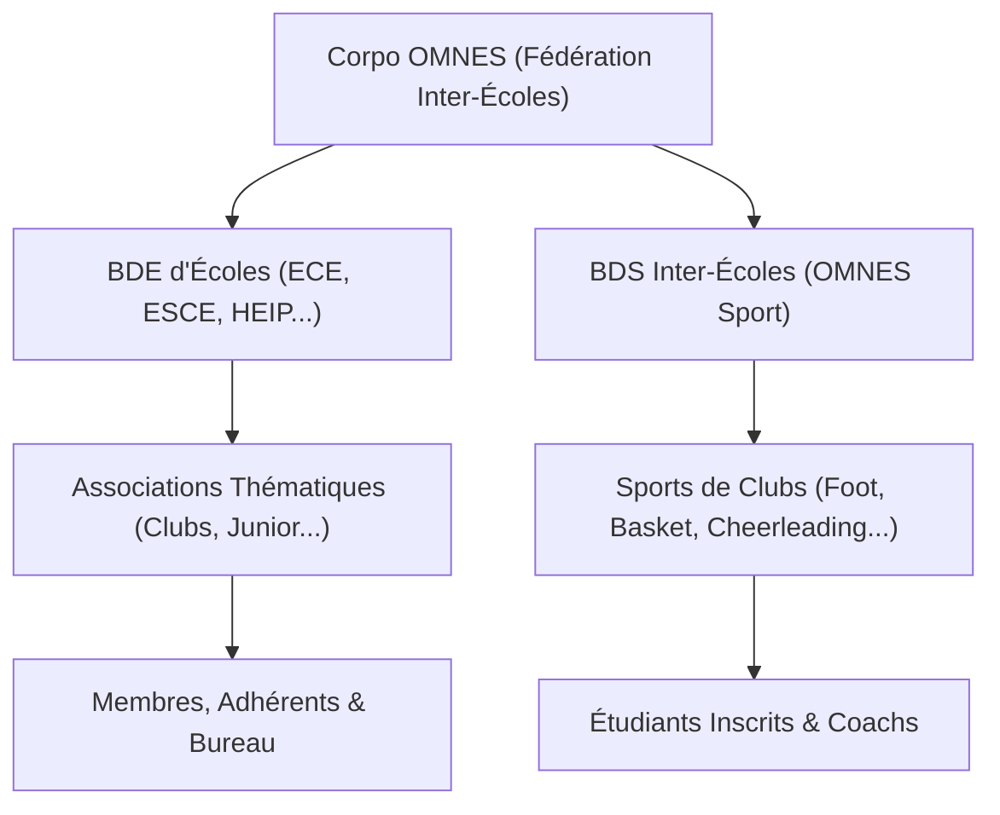

# 🌟 Corpo Omnes - Plateforme Intégrée de Gestion Associative & Événementielle

Corpo Omnes est une plateforme web complète et moderne conçue pour fédérer, animer et administrer la vie étudiante multi-écoles et multi-campus (comme les campus *Citadelle* et *Citroën* de Lyon). Écrite en **PHP 8.0+ natif** et s'appuyant sur une base de données relationnelle **MySQL**, elle offre une panoplie de fonctionnalités premium allant d'une billetterie sécurisée avec QR Codes à une comptabilité analytique synchronisée, en passant par des flux de validation de notes de frais à double signature.

---

## 🏛️ Modèle Structurel & Hiérarchie des Rôles

La plateforme applique une organisation hiérarchique stricte et granulaire modélisant fidèlement le tissu associatif étudiant :

### 👥 Rôles Globaux & Habilitations
1. **Super Admin** : Contrôle absolu sur l'ensemble de la plateforme, gestion des administrateurs, paramétrage global, et possibilité de forcer la validation comptable ou de rembourser.
2. **Admin Corpo** : Administration opérationnelle de la fédération, modération des propositions et gestion transversale.
3. **Membre Corpo** : Droits de publication d'actualités et d'événements à l'échelle de la Corpo.
4. **Utilisateur (Étudiant)** : Profil personnel, consultation du site, adhésions, inscriptions aux événements, et commandes en boutique.

### 🛡️ Rôles de Structure & Responsabilités Dédiées
Au sein de chaque entité (BDE, BDS, Association ou Sport), les membres possèdent un statut précis :
* **Adhérent** : A soumis une demande d'adhésion acceptée. Rôle consultatif.
* **Membre** : Membre actif de l'équipe (figurant sur la page publique de l'association).
* **Admin (Bureau)** : Habilitations de gestion complète de la structure.

Pour affiner les droits sans surcharger le Bureau, des **responsabilités fonctionnelles cumulables** peuvent être attribuées par les administrateurs de structure :
* 📅 **Responsable Événements** (`resp_evenement`)
* 🤝 **Responsable Partenariats** (`resp_partenariat`)
* 📢 **Responsable Communication** (`resp_communication`)
* 💰 **Responsable Trésorerie** (`resp_tresorerie`)

---

## ⚡ Fonctionnalités Clés de la Plateforme

### 1. 🎟️ Billetterie Unifiée & Contrôle d'Accès
Le cœur événementiel propose **6 modes d'inscription** hautement configurables :
* **Aucune** : Événement purement informationnel.
* **Email (Gratuit)** : Inscription rapide sans compte avec envoi immédiat du billet par email.
* **Connexion (Gratuit)** : Inscription pour les membres connectés possédant un compte vérifié.
* **Externe** : Redirection vers un service tiers (Lydia, Shotgun, etc.).
* **Billetterie + Email (Payant)** : Achat de billet sans compte obligatoire avec validation de paiement.
* **Billetterie + Connexion (Payant)** : Achat réservé aux titulaires de comptes connectés.

**Options Avancées de Billetterie & Inscriptions :**
* 📱 **Apple Wallet (`.pkpass`)** : Génération dynamique des billets de cinéma ou soirées au format Apple Wallet avec signature cryptographique PKCS#7 (intégrant le WWDR CA et un certificat d'identité développeur).
* 💳 **Google Pay / Wallet** : Prise en charge des passes Google Wallet (`api/event-gpay.php`).
* 📄 **Billets PDF & QR Codes** : Génération propre de reçus et billets imprimables à la volée avec FPDF et codes QR uniques.
* 📅 **Fichiers ICS** : Envoi de fichiers ICS en pièce jointe pour une intégration en un clic sur Google Calendar, Outlook ou Apple Calendar.
* ⏳ **File d'Attente Dynamique (Waitlist)** : Gestion automatique du flux d'inscriptions lorsque la jauge maximale d'un événement est atteinte, avec promotion automatique des participants en file d'attente en cas d'annulation.
* 🗺️ **Carte Interactive (Leaflet & OpenStreetMap)** : Intégration sur la page événement (`evenement.php`) d'une carte interactive Leaflet. Elle effectue du **géocodage client via l'API Nominatim (OSM)**, s'identifie de manière responsable, et stocke les coordonnées en **cache local browser (`localStorage`)** sous forme de clés `evt-geocode:<lieu>` pour préserver les quotas de requêtes Nominatim.

**Système de Validation & Scanner mobile :**
* 📷 **Scanner QR Intégré (html5-qrcode)** : Un lecteur de QR Code en temps réel s'appuyant sur la caméra du smartphone est présent dans la console administrative (`admin/evenement.php`).
* 🔊 **Feedback Visuel et Sonore** : Affichage plein écran coloré selon le statut (Vert pour Validé, Rouge pour Erreur/Déjà scanné, Orange pour Attention/Avertissement).
* 🛑 **Détection Anti-Fraude** : Validation instantanée via requêtes AJAX asynchrones (`api/qr-validate.php`), empêchant l'utilisation multiple ou croisée d'un même billet, avec identification et traçabilité en base de données du scanneur et de l'heure précise d'accès.
* ⌨️ **Saisie de Secours** : Possibilité de saisir manuellement les tokens ou de rechercher un participant dans la liste en cas de caméra défaillante.

### 2. 💳 Paiements Sécurisés & Routage Intelligent
* **Routage de Paiement Dynamique** : Selon le montant de la transaction ou des règles de frais, les paiements sont aiguillés dynamiquement vers **Stripe** ou **SumUp**.
* **Webhooks de Confirmation Asynchrones** : Les scripts `api/stripe-webhook.php` et `api/sumup-webhook.php` reçoivent en arrière-plan les validations bancaires, garantissant l'émission sécurisée du billet même si le navigateur de l'utilisateur a été fermé pendant le paiement.
* **Mode Mock Intégré** : En développement local, si les clés d'API Stripe ou SumUp sont absentes du fichier `.env`, le système bascule automatiquement sur un environnement de paiement simulé (Mock) pour tester l'intégralité du tunnel d'achat sans carte bancaire réelle.

### 3. 📊 Module de Comptabilité & Trésorerie Analytique
Chaque structure dispose d'un livre des comptes complet et autonome :
* **Multi-Comptes** : Gestion de plusieurs comptes financiers par structure (Banque, Caisse d'espèces, etc.) avec suivi du solde initial et du solde en temps réel.
* **Catégorisation Analytique** : Recettes (Cotisations, Sponsoring, Buvette...) et Dépenses (Fournitures, Transport, Restauration, Notes de frais...) configurables.
* **Rapprochement Automatique (Double Saisie Évitée)** :
  * Les transactions de billetterie payées en ligne sont importées automatiquement dans le grand livre comptable.
  * Les commandes de la boutique physique/en ligne sont également répertoriées en compta au fil de l'eau.
* **Saisie Manuelle avec Justificatifs** : Possibilité pour le trésorier d'enregistrer des écritures manuelles en y joignant un justificatif numérisé (facture, reçu).
* **Rapports & Exports** : Bilans recettes/dépenses, suivi de trésorerie mensuel et exports instantanés au format tableur CSV/Excel.

### 4. 📝 Double Validation des Notes de Frais
Un système sécurisé permet le remboursement rapide des frais avancés par les membres de structure :
* **Soumission rigoureuse** : Upload obligatoire du ticket au format PDF (limité à 10 Mo, stocké dans un dossier ultra-sécurisé bloqué par `.htaccess`).
* **Double Signature Habilitée** :
  1. **Validation Bureau** : Approuvé en premier par un membre actif du bureau (le demandeur ne peut pas valider sa propre note de frais).
  2. **Validation Trésorerie** : Validé ensuite par le responsable trésorerie (qui doit être une personne différente du validateur initial).
  * *Bypass Super Admin* : Possibilité de validation directe en une seule étape par le Super Admin de la plateforme.
* **Écriture Comptable Automatique** : Une fois la validation trésorerie effectuée, la note de frais passe au statut "Remboursée" et génère instantanément une transaction de dépense dans le grand livre de comptabilité de la structure, liée au justificatif PDF.

### 5. 🛍️ Boutique E-Commerce Intégrée
* Vente de produits dérivés (goodies, textiles de promo, sweat de BDE).
* Gestion des stocks, des variations de tailles (S, M, L, XL, etc.) et des catégories d'articles.
* Panier persistant et processus d'achat sécurisé par carte bancaire.
* Tableau de bord des commandes avec suivi du statut de préparation et de livraison.

### 6. 📰 Blog & Actualités (Visibilité Ciblée)
* Publication d'actualités avec gestion de la visibilité :
  * **Public** : Visible par l'ensemble des visiteurs.
  * **Membres** : Contenu exclusif destiné uniquement aux adhérents connectés d'une association.
* Système de modération et de validation : les actualités rédigées par des responsables de communication non-bureau sont envoyées dans une file de validation avant publication.

### 7. 🤝 Espace Partenaires & Sponsoring
* Annuaire des partenariats et codes promos négociés pour les étudiants (ex: salles de sport, restaurants, cinémas de proximité).
* Formulaire public d'onboarding (`demande-partenariat.html` & `.php`) permettant aux entreprises de proposer des offres directement aux administrateurs de la Corpo.

### 8. 📅 Calendrier Académique Collaboratif
* Saisie par les BDE du calendrier scolaire (examens, vacances, rattrapages, rentrées).
* Aide visuelle pour la planification d'événements associatifs afin d'éviter les conflits de dates avec les périodes académiques intenses de chaque école.

### 9. 📺 Affichage Dynamique TV (Signage Campus)
Développé spécifiquement pour les écrans géants des halls d'accueil (Résolution 1920x1080) :
* **`tv-agenda.html`** : Diaporama dynamique avec défilement fluide et infini (optimisé via `requestAnimationFrame`) des événements futurs.
* **`tv-spotlight.html`** : Mise en avant esthétique des actualités phares et des associations actives du campus.
* **Filtres Dynamiques & Thèmes** : En passant des paramètres en URL (ex: `?ecole=ECE` ou `?campus=Citadelle`), l'écran adapte automatiquement sa colorimétrie et sa charte graphique aux couleurs de l'école concernée et ne filtre que les événements pertinents. 
* **Mise à Jour Automatique** : Rechargement automatique de l'affichage toutes les 5 minutes et requêtes AJAX asynchrones sur `api/tv-evenements.php` pour rafraîchir la programmation en direct.

---

## 👑 Back-Office d'Administration (Espace Admin)

Le panneau d'administration (`admin/`) offre un environnement de pilotage complet et centralisé pour gérer les aspects quotidiens de la vie associative et académique :

### 1. 📧 Journal de Suivi des Mails & Quotas Brevo (`mails.php`)
* **Supervision en temps réel** : Visualisez et filtrez l'historique complet des e-mails envoyés par l'application (Statuts `OK`, `Erreurs`, `SMTP Debug`, `Mode Dev`).
* **Suivi de Quota Journalier** : Affiche un indicateur de consommation dynamique (Brevo limitant les comptes gratuits à 300 e-mails/jour, configurable via `MAIL_DAILY_LIMIT` dans le `.env`).
* **Outil de Diagnostics** : Lancement d'e-mails de test via `test-mail.php` et purge sécurisée des logs locaux de messagerie (`logs/mail.log`).

### 2. 🚦 Files de Modération & Demandes de Validation (`validation.php` & `demandes.php`)
* **Guichet unique d'approbation** : Les actualités, propositions d'événements, demandes de création d'associations, nouveaux sports ou nouveaux partenariats soumis par des contributeurs non-bureau atterrissent dans une file d'attente globale.
* **Workflow collaboratif** : Les administrateurs peuvent accepter (publication immédiate) ou rejeter (avec saisie obligatoire d'un motif de refus transmis à l'auteur) chaque requête.

### 3. 👥 Gestion Globale des Utilisateurs (`users.php`)
* **Annuaire et rôles** : Liste complète des comptes étudiants avec recherche multicritère (nom, promo, école, email).
* **Modifications administratives** : Attribution et modification des rôles globaux (`super_admin`, `admin_corpo`, `membre_corpo`, `user`), activation des comptes, suspensions temporaires ou réinitialisations forcées des mots de passe.

### 4. 🗂️ Modélisation et Hiérarchie des Structures (`structures.php`)
* **Arborescence dynamique** : Paramétrage des campus de l'école (Citadelle / Citroën), rattachement d'entités subordonnées (ex: attribuer des associations thématiques enfants à un BDE parent, ou des disciplines sportives à un BDS parent).
* **Éligibilité et logos** : Définition des listes blanches d'écoles autorisées pour chaque structure, et mise en ligne des logos associés (`upload-logo.php`).

### 5. 🛍️ Gestion Boutique & Suivi Commandes (`boutique.php` & `boutique-commandes.php`)
* **Administration du catalogue** : Ajout, modification et archivage de produits, édition des descriptions, tarifications, images de présentation, et gestion fine des tailles textiles disponibles.
* **Cycle de vie des commandes** : Suivi des statuts des achats boutique (`Init`, `En attente`, `Payé`, `Échec`, `Annulé`) et marquage de l'état de livraison/distribution aux étudiants.

### 6. 🏆 Management des Disciplines Sportives & Championnats (`sports.php`)
* **Fiches de clubs** : Configuration des sports, des emplacements géographiques, des quotas de places, et des liens d'accès (WhatsApp de groupe, etc.).
* **Entraînements et Référents** : Organisation des plannings d'entraînements et désignation des capitaines/coachs de chaque sport.
* **Résultats et Scores** : Saisie des scores de matchs universitaires et affichage en temps réel du classement face aux autres écoles lyonnaises (INSA, EM Lyon, etc.).

---

## 🛠️ Stack Technique

* **Langage** : PHP 8.0+ (utilisation des fonctions modernes telles que les expressions `match`, `str_contains`, le typage strict et la gestion robuste des erreurs).
* **Base de données** : MySQL 5.7+ / MariaDB.
* **Serveur recommandé** : Apache (avec module `mod_rewrite` activé).
* **Librairies embarquées (sans Composer pour maximiser la portabilité)** :
  * **PHPMailer** (`includes/lib/PHPMailer/`) : Expédition d'emails SMTP professionnels.
  * **FPDF** (`includes/lib/fpdf.php`) : Moteur de génération de documents PDF à la volée.
  * **PHP QR Code** (`includes/lib/qrcode.php`) : Production rapide de codes QR en PNG.
* **Traduction (i18n)** : Système natif bilingue Français (FR) et Anglais (EN) basé sur les sessions et les cookies (`set-lang.php`).

---

## 💻 Installation & Configuration Locale

### 📋 Prérequis PHP
Assurez-vous que les extensions PHP suivantes sont activées dans votre fichier `php.ini` :
* `pdo_mysql` (liaison DB)
* `gd` (nécessaire pour générer les QR Codes)
* `curl` (pour les appels de paiement Stripe & SumUp)
* `mbstring` (gestion des encodages de texte multibytes)
* `openssl` (chiffrement et signatures des tokens)
* `zip` (obligatoire pour le packaging des fichiers `.pkpass` Apple Wallet)
* `json`

### 🚀 Guide pas-à-pas

1. **Copie des fichiers** : Cloner le dépôt et placer le projet dans le dossier racine de votre serveur web (ex: `C:/xampp/htdocs/corpo-omnes-site`).
2. **Initialisation de la Base de Données** :
   * Créer une base de données MySQL nommée `corpo_omnes` en encodage `utf8mb4_unicode_ci`.
   * Importer le fichier `database.sql` disponible à la racine du projet (contient la structure initiale et un jeu de données de test complet).
3. **Configuration de l'environnement** :
   * Dupliquer le fichier `.env.example` et le renommer en `.env`.
   * Éditer les informations de connexion à la base de données (généralement déjà pré-configurées pour un environnement local standard).
4. **Paramétrage des Mots de Passe Initiaux** :
   * Lancer votre serveur Apache et ouvrir la page suivante dans votre navigateur :  
     `http://localhost/corpo-omnes-site/admin/setup-password.php`
   * Ce script va hacher les mots de passe de sécurité requis pour les comptes de test et configurer vos accès.
   * **⚠️ IMPORTANT** : Une fois cette étape franchie, **supprimez immédiatement** le fichier `admin/setup-password.php` pour des raisons de sécurité évidentes.
5. **Comptes de Test Créés par Défaut** :
   * **Super Admin** : `superadmin@corpo-omnes.fr` (Identifiant : `superadmin`)
   * **Admin Corpo** : `admin@corpo-omnes.fr` (Identifiant : `admincorpo`)
   * *Note : Les mots de passe sont ceux saisis à l'étape 4 du setup.*

---

## 🔄 Système de Migrations Automatisées
Si vous mettez à jour votre code ou déployez sur un environnement de production existant, n'importez **pas** le fichier `database.sql` (sous peine d'écraser vos données actives).
Utilisez plutôt l'outil de migration intelligent et idempotent :
* Rendez-vous sur la page : `http://localhost/corpo-omnes-site/admin/migrate.php`
* Connectez-vous avec le compte **Super Admin**.
* Le script analyse la structure actuelle de votre base de données et applique uniquement les modifications de colonnes, de tables et d'index manquants pour aligner votre DB sur la dernière version logicielle en préservant l'intégralité de vos données de production.

---

## ⚙️ Configuration du fichier `.env`

Le fichier `.env` héberge l'ensemble des configurations sensibles du serveur :

| Variable | Description / Rôle |
| :--- | :--- |
| `SITE_URL` | URL racine de l'application (ex: `http://localhost/corpo-omnes-site`). |
| `APP_SECRET` | Clé secrète utilisée pour signer les sessions et sécuriser les cookies. |
| `DB_HOST`, `DB_NAME`, `DB_USER`, `DB_PASS` | Paramètres d'accès à la base de données MySQL. |
| `MAIL_ENABLED` | Mettre à `1` pour envoyer de vrais emails via SMTP. Sinon, les emails sont écrits localement. |
| `MAIL_SMTP_HOST`, `MAIL_SMTP_PORT`, `MAIL_SMTP_SECURE` | Paramètres du serveur de messagerie (ex: Mailtrap, Gmail, Brevo). |
| `SUMUP_API_KEY` | Clé d'API SumUp. Si laissée vide, SumUp bascule en mode simulation (Mock). |
| `STRIPE_SECRET_KEY`, `STRIPE_WEBHOOK_SECRET` | Clés Stripe. Si laissées vides, Stripe fonctionne également en mode simulation (Mock). |
| `APPLE_WALLET_CERT_PATH`, `APPLE_WALLET_WWDR_PATH` | Chemins d'accès aux certificats Apple (.p12 et CA) pour la signature des pkpass. |

### 🪵 Gestion locale des e-mails en développement
Pour simplifier le développement sans avoir à configurer un serveur SMTP actif :
* Si `MAIL_ENABLED` n'est pas configuré sur `1` ou si le mot de passe SMTP est vide, **les e-mails ne sont pas perdus**.
* PHPMailer est contourné et le contenu intégral de chaque e-mail émis (sujet, destinataire, corps HTML) est enregistré dans le fichier local : `logs/mail.log`. Vous pouvez le consulter à tout moment pour valider vos tests de réception de billets ou de réinitialisation de mot de passe.

---

## 🔒 Sécurité & Protection des Données

* **Fichiers `.htaccess` protecteurs** :
  * Un fichier `.htaccess` à la racine interdit strictement l'accès HTTP direct aux fichiers sensibles tels que `.env`, les sauvegardes `.sql` ou les fichiers de logs `.log`.
  * Le dossier `images/justificatifs/` contient son propre fichier de configuration Apache limitant les accès HTTP aux seuls administrateurs habilités afin de sanctuariser les reçus de notes de frais des étudiants.
* **Sécurisation des Tokens d'Email** : Les liens de validation d'e-mail et de récupération de mot de passe s'appuient sur des tokens cryptographiques à usage unique, stockés sous forme de condensats **SHA-256** en base de données.
* **Hachage des Mots de Passe** : Cryptage natif via `password_hash()` utilisant l'algorithme fort **BCRYPT**.

---

## 📂 Organisation du Code (Arborescence)

* 📂 **`admin/`** : L'ensemble du Back-Office d'administration (gestion des membres, comptabilité, modération des demandes, configuration du calendrier scolaire).
* 📂 **`api/`** : Points d'accès JSON et utilitaires (recherche instantanée, génération d'images QR, exports XLS, fichiers pkpass, webhooks Stripe & SumUp, API de flux TV).
* 📂 **`css/` / `js/` / `images/`** : Feuilles de styles, scripts frontend et ressources graphiques de l'interface publique.
* 📂 **`includes/`** : Le moteur applicatif de la plateforme (connexion DB, sécurité d'authentification, gestion multilingue i18n, gestionnaires d'emails, de comptabilité et de notes de frais).
  * 📂 **`includes/lib/`** : Librairies tierces autonomes intégrées (FPDF, PHPMailer, QR Code).
* 📄 **`database.sql`** : Schéma d'origine et jeu d'essai SQL pour initialisation rapide.
* 📄 **`index.php`** : Page d'accueil publique du portail.

---

## ⚖️ Licence

Ce projet est sous licence propriétaire. Pour toute modification ou exploitation en dehors du cadre des campus partenaires, veuillez contacter la **Corpo OMNES Lyon**.
